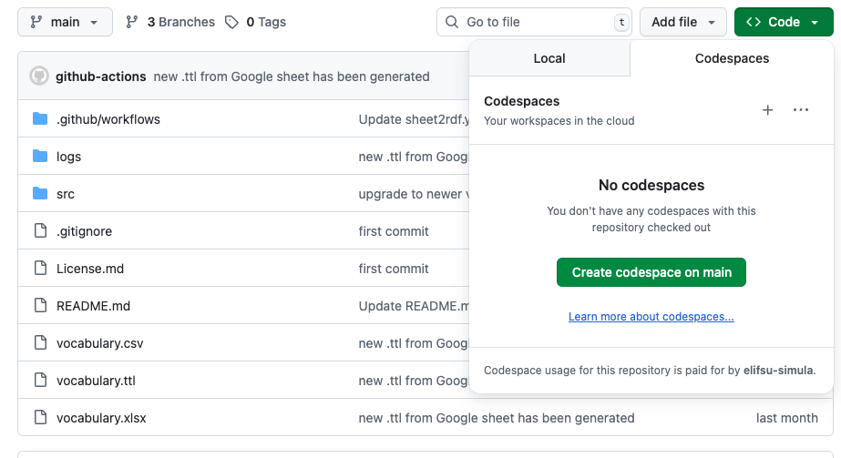
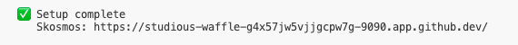

# Previewing Vocabulary in GitHub Codespaces

1. In the GitHub repo, go to **Code → Codespaces → Create codespace on main**. This starts a VS Code environment and brings up Skosmos in Docker for preview.

   

2. Wait a few minutes for containers to start. Once it is ready you can find the links to Skosmos in terminal.

   

3. If you make changes to the vocabulary, press **F1** and run **Codespaces: Rebuild Container** to restart services with the new changes.
4. If the container doesn’t start, press **F1** and run **Codespaces: View creation log** to see startup logs.
5. When you’re done, delete the Codespace (free plan includes ~60 hours/month).
